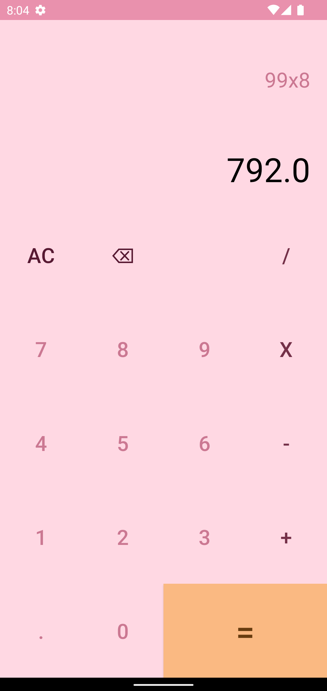
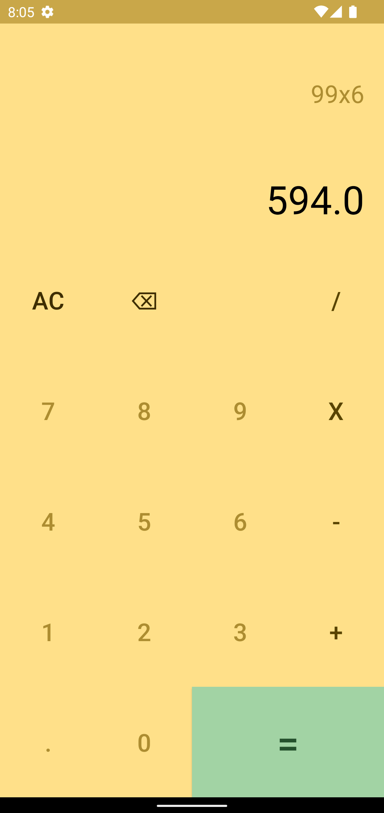
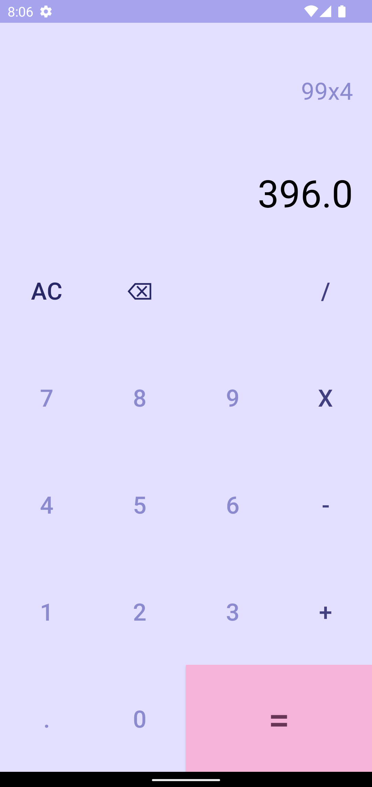
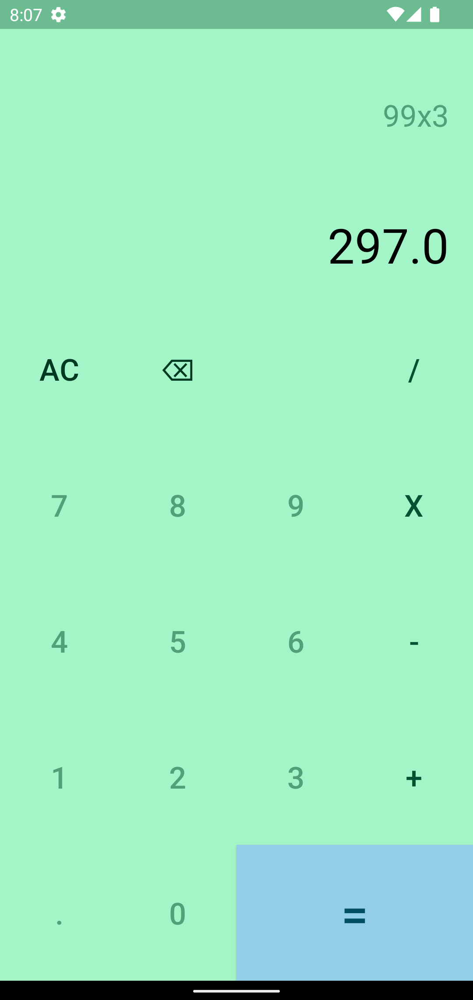

<h1 align="center" style="border-bottom: none">
    <b>
        <p>Kotlin Calculator</p><br>
    </b>
    🧮 A calculator app based on Material You. 🧮 <br>
</h1>

<p align="center">

<a href="https://github.com/codenameakshay/kotlin-calculator"></a>
<a href="https://github.com/codenameakshay/kotlin-calculator"></a>
<a href="https://github.com/codenameakshay/kotlin-calculator"></a>

</p>

<p align="center">
This is a basic calculator app made from Kotlin, which uses Monet Engine on Android 12.
</p>


## Screenshots

| Screenshot 1 	| Screenshot 2 	| Screenshot 3 	| Screenshot 4 	| Screenshot 5 	|
|--------------	|--------------	|--------------	|--------------	|--------------	|
|   |  	|   	|    	|   	|

## Built With

* [Kotlin](https://kotlinlang.org/)

## Getting Started

To build on MacOS or Windows, please follow these simple steps.

**Step 1:**

```shell
git clone https://github.com/codenameakshay/kotlin-calculator.git
```

**Step 2:**

Follow the instructions [here](https://developer.android.com/studio) to install Android Studio. Then you're ready to build the app.

For testing the app you can create an emulator following the steps [here](https://developer.android.com/studio/run/emulator), or directly run on a physical Android device.

Monet engine works on API level 31, so make sure you have correct API on your emulator, otherwise the app will use default colors.

## Releases

Please see the [releases tab](https://github.com/codenameakshay/kotlin-calculator/releases) for more details about the latest release.

## Contributing
First off, thanks for visiting this repo and taking your time to read this doc.
Any contributions you make are **greatly appreciated**.

If you'd like to propose a feature, submit an issue [here](https://github.com/codenameakshay/kotlin-calculator/issues).

## License

Distributed under the GPL-3.0 License. See `LICENSE` for more information.

## Contributers

<a href="https://github.com/codenameakshay/kotlin-calculator/graphs/contributors">
  
</a>

### If you made it here, thanks for your support. You can show more support by starring this repo. See ya! 👋
